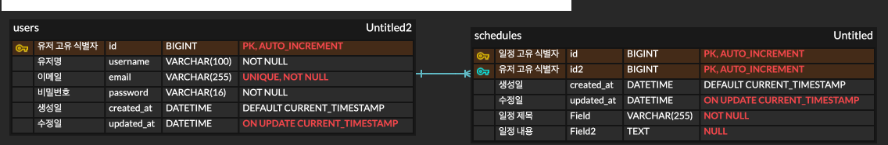

###  일정 API

| 기능 | Method | URL | 요청 값 | 응답 값 | 상태코드 |
| --- | --- | --- | --- | --- | --- |
| 일정 등록 | POST | /api/schedules | { "title": "string", "content": "string" } | { "id": 1, "title": "...", ... } | 200 |
| 일정 조회(단건) | GET | /api/schedules/{scheduleId} | PathVariable | { "id": 1, "title": "...", ... } | 200 |
| 일정 목록 조회 | GET | /api/schedules | 없음 | [ { "id": 1, "title": "...", ... }, ... ] | 200 |
| 일정 수정 | PUT | /api/schedules/{scheduleId} | { "title": "수정 제목", "content": "수정 내용" } | 수정된 일정 정보 | 200 |
| 일정 삭제 | DELETE | /api/schedules/{scheduleId} | PathVariable | 없음 | 200 |

---

###  유저 API

| 기능 | Method | URL | 요청 값 | 응답 값                                           | 상태코드 |
| --- | --- | --- | --- |------------------------------------------------| --- |
| 회원가입 | POST | /api/users/signup | { "username": "사용자", "email": "user@email.com", "password": "1234" } | 회원가입 완료 메시지                                    | 200 |
| 로그인 | POST | /api/users/login | { "email": "...", "password": "..." } | 세션 쿠키 + 로그인 성공 메시지                             | 200 |
| 로그아웃 | POST | /api/users/logout | 없음 | 로그아웃 완료 메시지                                    | 200 |
| 내 정보 조회 | GET | /api/users/me | 없음 | { "id": 1, "username": "...", "email": "..." } | 200 |

### ERD 설계도

.png)